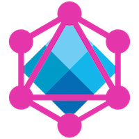

# Introducción a GraphQL 

Cuando hablamos de GraphQL nos referimos tanto a un lenguaje que nos permite hacer consultas así como un intérprete que permite resolver esas consultas usando los datos de nuestra aplicación.

## Esquemas de GraphQL

En primer lugar debemos usar el lenguaje provisto por GraphQL para definir el [esquema (schema)](https://graphql.org/learn/schema/#type-language) de nuestra aplicación. Pero, ¿qué es un esquema? __Un esquema es una colección de tipos__ los cuales permiten representar el __grafo de los datos de nuestra aplicación__. Es decir, supongamos que en nuestra aplicación tenemos los siguientes datos:

<p align="center">
  
</p>

Nuestro esquema entonces estaría compuesto en principio por tres tipos: uno para la Playlist, otro para el Track y finalmente otro para el Artist. Cada uno de estos tipos asimismo está compuesto por ciertos campos (fields) que pueden ser escalares o no escalares.

Los campos escalares permiten representar propiedades de un tipo como el id o el nombre, mientras que los campos no escalares representan las relaciones con otros nodos dentro del grafo. Por ejemplo, una posible definición de un tipo sería la siguiente:

```graphql
type Playlist {
  id: String
  name: String
  tracks: [Track]
}
type Track {
  id: String
  name: String
  artist: Artist
}
type Artist {
  id: String
  name: String
}
```

## Consultas a un esquema y el tipo Query

Una vez que hemos definido los tipos que componen el dominio de nuestra aplicación debemos todavía definir un tipo más que nos permitirá realizar consultas sobre nuestro esquema, este es el tipo [Query](https://graphql.org/learn/schema/#the-query-and-mutation-types).

El esquema que definimos anteriormente nos permite representar un grafo pero cuando escribimos una consulta en GraphQL estamos seleccionando un subgrafo de ese grafo. __El tipo Query actúa como punto de entrada para las consultas__ (es el nodo raíz a partir del cual se empieza a recorrer el grafo para construir la respuesta a la consulta) y lista todos los posibles campos a partir de los cuales podemos comenzar a navegar el grafo de nuestra aplicación. 

En nuestro ejemplo, podríamos contar con la siguiente definición del tipo Query, que nos permitiría obtener entidades independientes así como colecciones. Por ejemplo:

```graphql
type Query {
  playlist(id: String): Playlist
  playlists: [Playlist]
  artist(id: String): Artist
  artists: [Artist]
  track(id: String): Track
  tracks: [Track]
}
```

Teniendo nuestro esquema definido, podemos escribir distintas consultas para obtener los datos de nuestra aplicación.

Las [consultas en GraphQL](https://graphql.org/learn/queries/) tienen un formato sencillo: comenzamos seleccionando uno o más campos del tipo query; por cada campo, si este campo devuelve un valor de tipo escalar entonces terminamos ahí, pero si devuelve un campo de tipo objeto entonces debemos elegir uno o más campos correspondientes a este tipo. Lo que podemos observar es que este proceso describe un árbol cuyas hojas son los campos con tipos escalares.

```graphql
query getPlaylist {
  playlist(id: “playlist-1”) {
    id
    name
    tracks {
      id
      name
      artist {
        name
      }
    }
  }
}
```

Una vez que tenemos nuestra consulta entonces estamos en condiciones enviarla a nuestro intérprete el cual nos va a devolver un objeto JSON que respeta la estructura que describimos en nuestra consulta.

```json
{
  "data": {
    "playlist": {
      "id": "playlist-1",
      "name": "Rock Nacional",
      "tracks": [{
        "id": "track-1",
        "name": "Ala Delta",
        "artist": {
          "name": "Divididos"
        },
      }],
    }
  }
}
```

## Resolvers

Hasta ahora vimos cómo definir un esquema usando GraphQL y cómo construir diferentes consultas sobre ese esquema. Lo que no está claro es como dada una consulta, el intérprete de GraphQL es capaz de recuperar los datos seleccionados en la consulta.

Este esquema nos permite crear una instancia de un intérprete GraphQL, lo único que requiere a tal fin es contar con la definición del esquema completo y con un conjunto de funciones (llamadas [resolvers](https://graphql.org/learn/execution/#root-fields-resolvers)) que permiten calcular los campos relevantes de los tipos de nuestro esquema.

Entonces si tenemos un tipo Track definido como sigue:

```graphql
type Query {
  track(id: String): Track
}
type Track {
  id: String
  name: String
}
```

Podriamos definir los resolvers como se muestra a continuación:

```javascript
const tracksData = {
  track1: {
    id: ‘track1’,
    name: ‘Ala Delta’,
    artistId: ‘artist1’,
  },
};

const resolvers = {
  Query: {
    track: (obj, param) => tracksData[param.id],
  },
};
```

Pero si además nuestro tipo Track tuviera un campo de tipo Artist (es decir, de un valor no escalar), entonces nuestros resolvers podrían definirse como se muestra a continuación:

```graphql
type Query {
  track(id: String): Track
}
type Track {
  id: String
  name: String
  artist: Artist
}
type Artist {
  id: String
  name: String
}
```

```javascript
const tracksData = {/*...*/};
const artistData = {/*...*/};
const resolvers = {
  Query: {
    track: (obj, param) => tracksData[param.id],
  },
  Track: {
    artist: obj => artistData[obj.artistId],
  },
};
```

## Material adicional

- Caso de uso: GraphQL en Medallia https://www.youtube.com/watch?v=OkJLTOOZ9vM
- GraphQL home page: https://graphql.org/
- GraphQL tools: https://www.apollographql.com/docs/graphql-tools/
- ApolloJS home page (cliente de GraphQL): https://www.apollographql.com/
- GraphQL concepts: https://dev-blog.apollodata.com/the-concepts-of-graphql-bc68bd819be3
