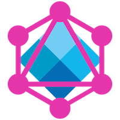

# GraphQL FileSystem · 

Este workshop se da en el marco de la [NodeConf Argentina 2018](https://2018.nodeconf.com.ar/alan-accurso-sebastian-urbina.html).

## Detalles

GraphQL ha revolucionado la forma en que desarrollamos y consumimos nuestras APIs, brindando una estructura completa y entendible para nuestro modelo de datos. En este workshop vamos a repasar sus conceptos fundamentales y ponerlos en práctica para implementar un servicio que nos permitirá realizar consultas al filesystem usando solo GraphQL (y Apollo :smile:).

## Agenda

- [Intro](/INTRO.md): Conceptos fundamentales de GraphQL.
- [Step 0](/steps/STEP-0.md): Setup del proyecto y enunciado del ejercicio que vamos a resolver en el workshop.
- [Step 1](/steps/STEP-1.md): Listar los nombres de los archivos.
- [Step 2](/steps/STEP-2.md): Listar los nombres de los directorios.
- [Step 3](/steps/STEP-3.md): Listar los directorios y sus archivos de forma recursiva.
- [Step 4](/steps/STEP-4.md): Listar archivos y directorios con un único comando.
- [Step 5](/steps/STEP-5.md): Listar archivos y directorios de forma recursiva.
- [Step 6](/steps/STEP-6.md): Listar archivos y directorios de un directorio específico.
- [Step 7](/steps/STEP-7.md): Crear archivo.
